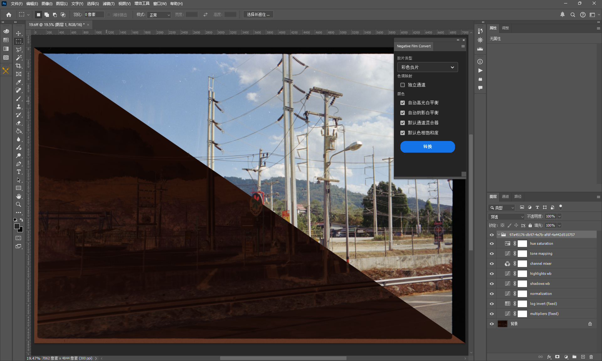

# Negative Film Convert

    

## 简介

Photoshop插件，用于负片胶片校色，也可以作为负片处理的一个初始点。

## 使用方法

### 线性TIFF

为了达到比较好的转换效果，最好使用线性TIFF格式，并且使用16位深度。

ColorPerfect 提供的大部分扫描仪线性 TIFF 操作方法 [https://www.colorperfect.com/scanning-slides-and-negatives/creating-linear-scans/](https://www.colorperfect.com/scanning-slides-and-negatives/creating-linear-scans/)

### MakeTiff

ColorPerfect 提供的免费工具，可以将各种RAW等格式转换为线性TIFF格式。使用比较简单，只需要拖入窗口即可。

[MakeTiff 介绍](https://www.colorperfect.com/MakeTiff/)

[MakeTiff 安装](https://www.colorperfect.com/MakeTiff/Installation/)

MakeTiff 依赖于 [Adobe DNG Converter](https://helpx.adobe.com/tw/camera-raw/using/adobe-dng-converter.html)

### LibRaw 或 Dcraw

MakeTiff 的原理为：

1. 调用 Adobe DNG Converter 进行基础的RAW转换，如去马赛克等。
2. 调用 LibRaw 进行线性 TIFF 转换。
3. 调用 exiftools 修改 TIFF 的 EXIF 信息。

所以直接使用 LibRaw 或 Dcraw 也可以达到基本一致的效果。

### 其他方式生成线性 TIFF

 - RawTherapee darktable 等软件，因依赖于 LibRaw，所以也可以生成合适的线性 TIFF。但需要做一些配置调整。
 - Capture One 等，但由于这种常规 RAW 解码目的是为了生成好看的图片，所以会加入很多色彩调整，生成的线性 TIFF 理论上反而不合适负片校色使用。

### 使用插件对 TIFF 进行转换

- 剪裁掉非底片区域，减少对计算的干扰。

## 图层功能

- multipliers: 基础的右侧缩放，对数码化时曝光不足的会有一定改善。
- log invert: LOG 转换。会根据计算使用相对合适的的曲线。
- normalization: 对齐通道。
- shadows wb: 暗部白平衡调整。
- highlights wb: 亮部白平衡调整。
- channel mixer: 一定程度上模拟负片色域。
  
## 注意事项

- 非开箱即用，需要根据实际情况调整。
- 翻拍时尽量向右曝光
- 调整曝光尽量在 tone mapping 之前的对数域中调整，最好只使用曲线工具的直线和单点曲线调整。
- 因未考虑使用完全曝光区域，所以在图像中有完全曝光区域时会色彩不正确。
- 尽量使用颜色比较中性的图像作为基础的转换、调整图像。
- 可将同种、同时冲洗的多张图片合并为一张，以减少误差。
- 调整满意后，可使用 Photoshop 的导出图层、动作、批处理等批量转换。