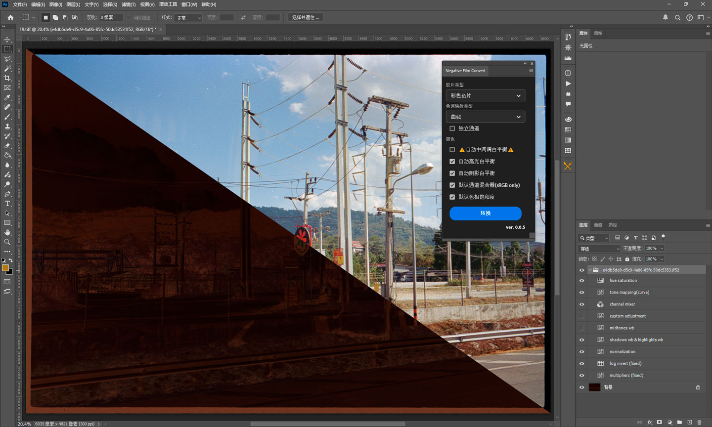
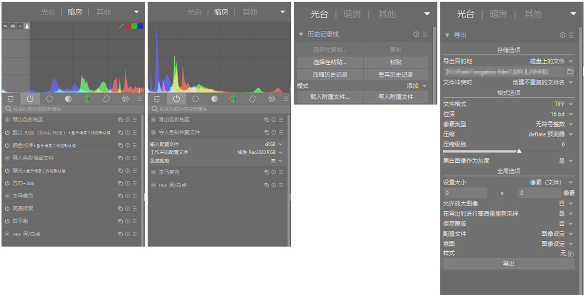
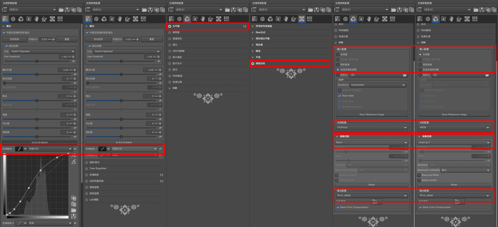

# Negative Film Convert

    

# 简介

Photoshop插件，用于负片胶片校色，也可以作为负片处理的一个初始点。

# 线性TIFF

为了达到比较好的转换效果，最好使用无色彩调整的16位线性TIFF格式。

部分扫描仪可通过扫描软件直接生成，可参照 ColorPerfect 提供的大部分扫描仪线性 TIFF 操作方法。[https://www.colorperfect.com/scanning-slides-and-negatives/creating-linear-scans/](https://www.colorperfect.com/scanning-slides-and-negatives/creating-linear-scans/)

RAW 可通过转换生成 TIFF。

# RAW 转 TIFF

转换方式举例，可按需调整。

## MakeTiff

[MakeTiff 介绍](https://www.colorperfect.com/MakeTiff/) [MakeTiff 安装](https://www.colorperfect.com/MakeTiff/Installation/)

ColorPerfect 提供的免费工具。使用简单，拖入窗口即可。

MakeTiff 依赖于 [Adobe DNG Converter](https://helpx.adobe.com/tw/camera-raw/using/adobe-dng-converter.html)

## darktable

[https://www.darktable.org](https://www.darktable.org)

(可选) Adobe DNG Converter 基础转换

关闭所有色彩优化调整。

导入色彩档案文件 - 输入配置文件 - sRGB

同步修改历史

选择合适的导出色彩空间导出16位 TIFF

## RawTherapee

[https://www.rawtherapee.com](https://www.rawtherapee.com)

(可选) Adobe DNG Converter 基础转换

关闭 曝光-色调曲线 白平衡 捕图加锐

调整 ICM 设置

同步配置

批量导出16位 TIFF

## LibRaw 或 Dcraw

[https://www.libraw.org](https://www.libraw.org)

[https://dechifro.org/dcraw](https://dechifro.org/dcraw)

1. (可选) Adobe DNG Converter 基础转换
2. 转换 TIFF
   -  LibRaw `dcraw_emu -v -r 1 1 1 1 -H 1 -o 0 -4 -T raw文件`
   -  Dcraw `dcraw -v -r 1 1 1 1 -H 1 -o 0 -4 -T raw文件`
3. (可选) exiftools 复制 EXIF 信息。

## 其他方式生成线性 TIFF

 - Capture One 等，但由于这种常规 RAW 解码目的是为了生成好看的图片，所以会加入很多色彩调整，生成的线性 TIFF 理论上反而不合适负片校色使用。

# 图层功能

- multipliers: 基础的右侧缩放，对数码化时曝光不足的会有一定改善。
- log invert: LOG 转换。会根据计算使用相对合适的的曲线。
- normalization: 对齐通道。
- shadows wb: 暗部白平衡调整。
- highlights wb: 亮部白平衡调整。
- channel mixer: 一定程度上模拟负片色域。
  
# 注意事项

- 非开箱即用，需要根据实际情况调整。
- 剪裁掉非底片区域，减少对计算的干扰。
- 翻拍时尽量向右曝光
- 调整曝光尽量在 tone mapping 之前的对数域中调整，最好只使用曲线工具的直线和单点曲线调整。
- 因未考虑使用完全曝光区域，所以在图像中有完全曝光区域时会色彩不正确。
- 尽量使用颜色比较中性的图像作为基础的转换、调整图像。
- 可将同种、同时冲洗的多张图片合并为一张，以减少误差。
- 调整满意后，可使用 Photoshop 的导出图层、动作、批处理等批量转换。